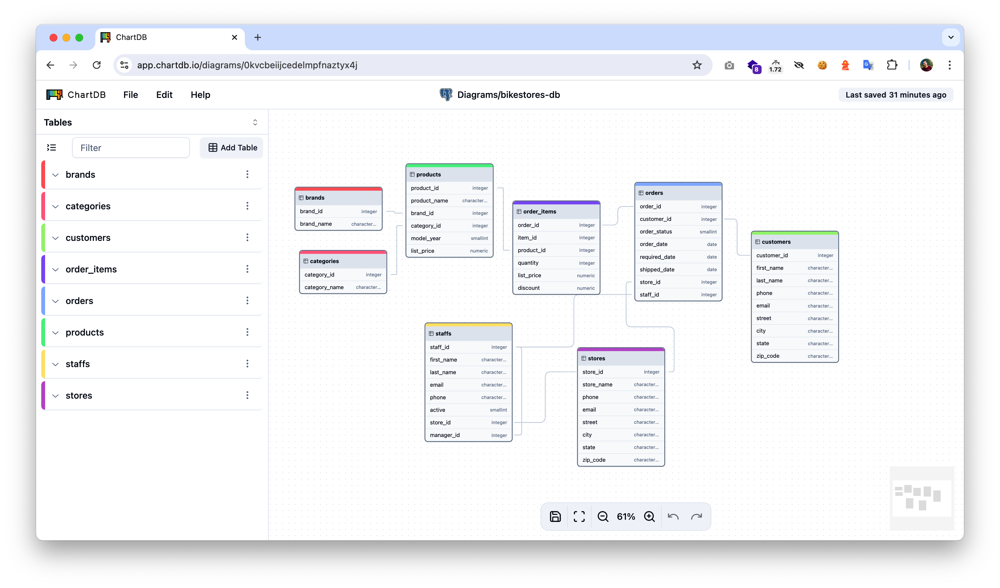

<h1 align="center">
  <a href="https://chartdb.io#gh-light-mode-only">
    
  </a>
  <a href="https://chartdb.io##gh-dark-mode-only">
    
  </a>
  <br>
</h1>

<p align="center">
  <b>Open-source database diagrams editor</b> <br />
  <b>No installations • No Database password required.</b> <br />
</p>

<h3 align="center">
  <a href="https://discord.gg/QeFwyWSKwC">Community</a>  &bull;
  <a href="https://www.chartdb.io?ref=github_readme">Website</a>  &bull;
  <a href="https://chartdb.io/templates?ref=github_readme">Examples</a>  &bull;
  <a href="https://app.chartdb.io?ref=github_readme">Demo</a>
</h3>

---

<p align="center">
  
</p>

ChartDB is a powerful, web-based database diagramming editor. Instantly visualize your database schema with a single **"Smart Query."** Customize diagrams, export SQL scripts, and access all features — no account required.

### Supported Databases

- ✅ PostgreSQL (+ Supabase + Timescale)
- ✅ MySQL
- ✅ SQL Server
- ✅ MariaDB
- ✅ SQLite (+ Cloudflare D1)
- ✅ CockroachDB
- ✅ ClickHouse

---

## Getting Started

```bash
npm install
npm run dev
```

Open `http://localhost:3000`. That's it — no backend required.

---

## Environment Variables

All environment variables are optional. The app works fully in the browser with local IndexedDB storage when none are set.

### AI (optional)

Enables the AI-powered DDL export and schema assistant. Set **one** of the following options:

**OpenAI**
| Variable | Description |
|---|---|
| `NEXT_PUBLIC_OPENAI_API_KEY` | OpenAI API key — defaults to `gpt-4o-mini-2024-07-18` |

**Anthropic**
| Variable | Description |
|---|---|
| `NEXT_PUBLIC_ANTHROPIC_API_KEY` | Anthropic API key — defaults to `claude-haiku-4-5-20251001` |

**Custom / self-hosted (OpenAI-compatible)**
| Variable | Description |
|---|---|
| `NEXT_PUBLIC_OPENAI_API_ENDPOINT` | Inference server base URL (e.g. `http://localhost:8000/v1`) |
| `NEXT_PUBLIC_LLM_MODEL_NAME` | Model name served at that endpoint |

> Priority when multiple are set: **custom endpoint** → **OpenAI** → **Anthropic**.  
> Override the default model for any provider by also setting `NEXT_PUBLIC_LLM_MODEL_NAME`.

### Auth & Cloud Storage (optional)

Enables user accounts, cloud diagram persistence, and diagram sharing. Requires a [Supabase](https://supabase.com) project.

| Variable                        | Description                                                        |
| ------------------------------- | ------------------------------------------------------------------ |
| `NEXT_PUBLIC_SUPABASE_URL`      | Your Supabase project URL                                          |
| `NEXT_PUBLIC_SUPABASE_ANON_KEY` | Supabase anonymous (public) key                                    |
| `SUPABASE_SERVICE_ROLE_KEY`     | Service role key — used only in API routes for collaborator writes |

After creating your Supabase project, run [`supabase-schema.sql`](./supabase-schema.sql) in the Supabase Dashboard → SQL Editor.

### Realtime Collaboration (optional)

Enables live multi-user cursors and diagram sync. Requires a [Liveblocks](https://liveblocks.io) account **and** Supabase auth to be configured.

| Variable                         | Description                                          |
| -------------------------------- | ---------------------------------------------------- |
| `NEXT_PUBLIC_LIVEBLOCKS_ENABLED` | Set to `true` to enable realtime features            |
| `LIVEBLOCKS_SECRET_KEY`          | Liveblocks secret key (`sk_...`) from your dashboard |

### Other

| Variable                        | Description                                          |
| ------------------------------- | ---------------------------------------------------- |
| `NEXT_PUBLIC_APP_URL`           | Public URL of your deployment (used for share links) |
| `NEXT_PUBLIC_DISABLE_ANALYTICS` | Set to `true` to disable Fathom Analytics            |

---

## Docker

The pre-built image on `ghcr.io` supports **full runtime configuration** — no rebuild needed. All `NEXT_PUBLIC_*` variables are injected at container startup via `docker-entrypoint.sh`, which writes them into `public/config.js` so the browser picks them up through `window.env`.

#### Using the pre-built image (recommended)

```yaml
# docker-compose.yml
services:
    chartdb:
        image: ghcr.io/snapaslabs/chartdb-next:latest
        restart: always
        ports:
            - '8080:8080'
        environment:
            # AI — pick one provider
            - NEXT_PUBLIC_OPENAI_API_KEY=<your-key>
            # - NEXT_PUBLIC_ANTHROPIC_API_KEY=<your-key>

            # Auth & cloud storage (optional)
            - NEXT_PUBLIC_SUPABASE_URL=<your-url>
            - NEXT_PUBLIC_SUPABASE_ANON_KEY=<your-anon-key>
            - SUPABASE_SERVICE_ROLE_KEY=<your-service-key>

            # Realtime collaboration (optional, requires Supabase)
            - NEXT_PUBLIC_LIVEBLOCKS_ENABLED=true
            - LIVEBLOCKS_SECRET_KEY=<sk_...>
```

> `SUPABASE_SERVICE_ROLE_KEY` and `LIVEBLOCKS_SECRET_KEY` are server-side only and are never exposed to the browser.

#### Build locally

```bash
docker build -t chartdb .
docker run -p 8080:8080 \
  -e NEXT_PUBLIC_SUPABASE_URL=<url> \
  -e NEXT_PUBLIC_SUPABASE_ANON_KEY=<key> \
  -e SUPABASE_SERVICE_ROLE_KEY=<key> \
  -e NEXT_PUBLIC_LIVEBLOCKS_ENABLED=true \
  -e LIVEBLOCKS_SECRET_KEY=<sk_...> \
  chartdb
```

---

## Community & Support

- [Discord](https://discord.gg/QeFwyWSKwC)
- [GitHub Issues](https://github.com/chartdb/chartdb/issues)
- [Twitter](https://x.com/intent/follow?screen_name=jonathanfishner)

## License

ChartDB is licensed under the [GNU Affero General Public License v3.0](LICENSE)
